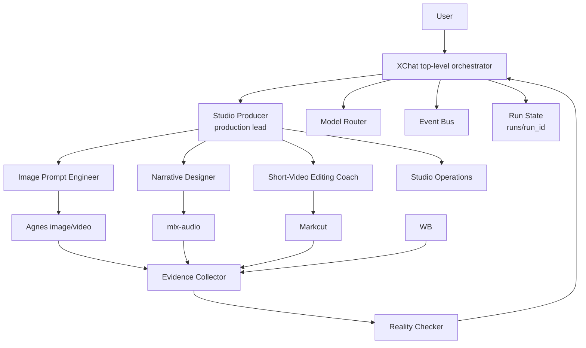
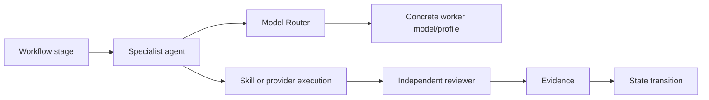
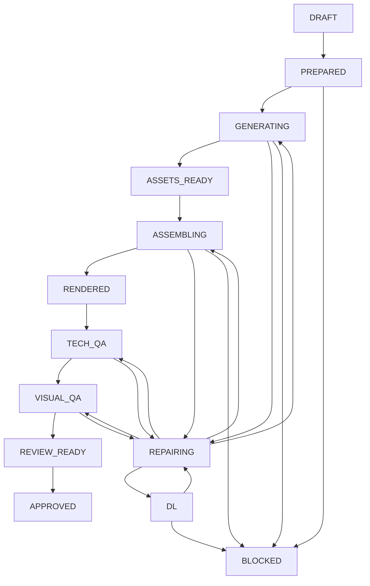
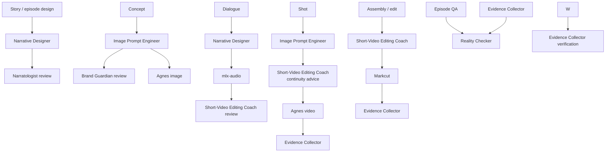
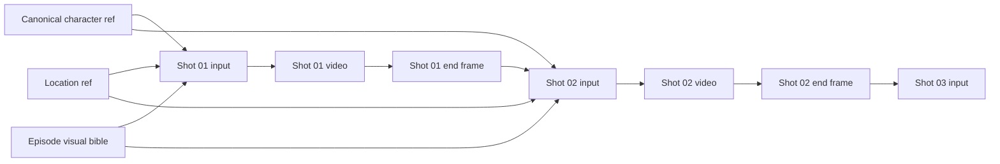
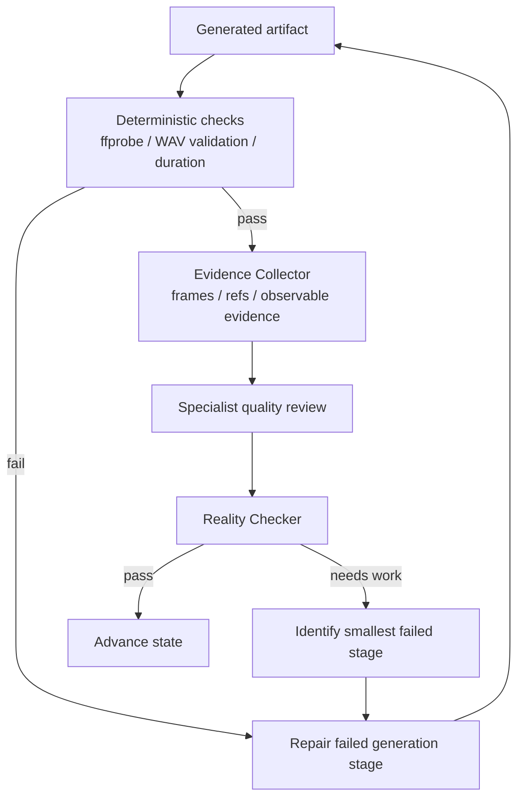
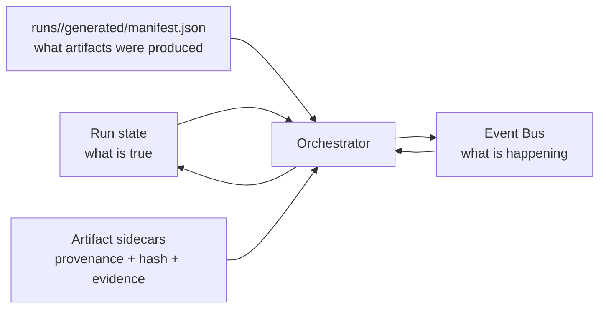
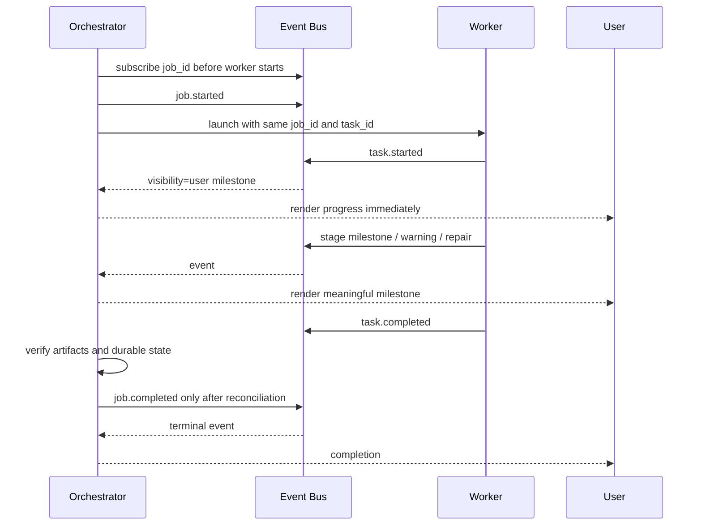
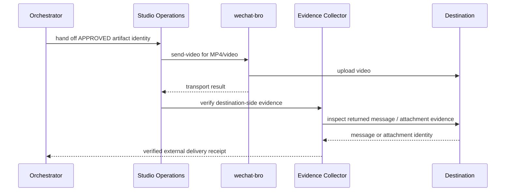
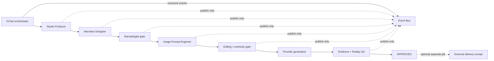

# Drama production workflow

This document is the orchestration contract for repeatable Drama production. It exists so a new XChat session can resume the project without rediscovering who should do each job, what evidence is required, or when a stage is actually complete.

Machine-readable routing lives in `config/workflow.json`.

## Core principles

- One production run uses one top-level `job_id`. A repair is a state transition inside the same run, not a new top-level workflow.
- `runs/<run_id>/*.json` is durable business state. Event Bus is live telemetry. `runs/<run-id>/generated/manifest.json` is artifact-stage provenance.
- Agent role and model are separate. Choose the specialist agent first, then apply `model-router` for a new delegated model worker.
- Generation providers execute; they do not approve their own output.
- `generated != accepted`, `rendered != approved`, and `sent != delivered`.
- A stage advances only when its configured success evidence exists.
- Repair the smallest failed stage and preserve accepted upstream artifacts.

## 1. Responsibility map



The orchestrator owns lifecycle and state. Specialist agents own domain decisions. Providers and skills execute bounded operations. Independent reviewers inspect observable artifacts.

## 2. Three-level routing



Example: `shot` selects `image-prompt-engineer`; model-router chooses the worker model; Agnes executes; `evidence-collector` reviews frames and continuity evidence; only then does the episode state advance.

## 3. End-to-end episode pipeline



`FAILED` is reserved for a terminal failed run. `BLOCKED` means the run can continue when an external blocker is removed.

## 4. Stage-to-agent routing



The exact routing is defined in `config/workflow.json`. Before launching a configured agent, verify that `~/.codex/agents/<agent-id>.toml` exists. `./drama.sh workflow` reports that availability.

## 5. Shot continuity chain



A shot plan may set `continuity_from` to an earlier shot. `drama.py` then extracts the previous shot's final frame and uses it as the Agnes image-to-video input. This intentionally reduces freedom between adjacent shots.

Example:

```json
{
  "id": "shot02",
  "continuity_from": "shot01",
  "duration_sec": 5,
  "video_prompt": "桃桃保持上一镜头的外观和卧室光线，缓慢转向音乐盒……"
}
```

`continuity_from` must reference an earlier shot in the same episode.

## 6. QA and repair loop



A model saying `PASS` is not enough. QA should combine deterministic media checks, sampled evidence, continuity checks, and narrative coverage.

## 7. State, events, and artifacts are different things



Do not infer durable success from an event alone. Do not use `runs/<run-id>/generated/manifest.json` as the whole workflow state. Do not reconstruct live progress from state files when the Event Bus is available.

## 8. Event Bus lifecycle



A wait timeout is not completion. `task.completed` is not necessarily top-level completion. The owning orchestrator stays in the event loop until a top-level terminal event or an abnormal worker exit is reconciled.

## 9. External delivery adapter (outside Drama core)



This sequence is not part of the Drama core state machine. Drama remains `APPROVED` whether delivery succeeds or fails. A command invocation is not delivery proof. If transport returns an error, the external delivery job cannot emit success. A delivery receipt should bind destination to exact artifact hash/revision and destination message identity. For WeChat MP4/video, use `send-video`; use `send-file` only for non-video attachments.

## Artifact identity

Working renders may remain at `runs/<run-id>/generated/video/<episode>-render.mp4`, but anything handed to a reviewer or external destination should have an unambiguous identity:

```text
taotao-ep04-r001-a1b2c3d4.mp4
```

The delivery receipt should include episode, revision, SHA-256, duration, creation time, and source manifest version. This prevents ambiguity such as duplicate `001` or `002` files.

## Starting the next episode, for example ep04

A future request such as “generate 004” should be interpreted as a new episode production run, not as a direct call to Agnes.

1. Run `./drama.sh status` and `./drama.sh workflow`.
2. Create one `run_id` and one top-level Event Bus `job_id`; establish event consumption before delegation.
3. Route story work to `narrative-designer`, with `narratologist` review.
4. Add `ep04` to `runs/<run-id>/story/series.json`, then create `runs/<run-id>/episodes/ep04/script.json`, `shots.json`, and `storyboard.md`.
5. Use continuity fields in `shots.json` where adjacent shots should preserve composition or character state.
6. Run `./drama.sh prepare`.
7. Generate only missing assets. Reuse approved canonical assets.
8. Validate every generated video technically before marking its generation stage succeeded.
9. Assemble and render with Markcut.
10. Collect evidence and route final episode QA through `reality-checker`.
11. Stop the Drama core at `APPROVED`. If delivery is requested, launch a separate channel-adapter job from that approved artifact and verify destination-side evidence before completing the delivery job.
12. If anything fails, update the same run to `REPAIRING`, repair the smallest failed stage, and continue the same job.

## What to observe on the ep04 experiment

The next run is useful as a workflow experiment. Observe these separately:

- whether the correct specialist agent was selected at each stage;
- whether model routing happened after agent selection;
- whether one stable job/run survived repair cycles;
- whether progress was proactively surfaced from Event Bus;
- whether continuity inputs were actually used between shots;
- whether QA produced concrete evidence rather than self-confirming prose;
- whether upstream accepted artifacts were preserved during repair;
- whether final delivery used exact artifact identity and destination verification.

The goal of ep04 is not only a better video. It is evidence that the production system behaves coherently end to end.

## 10. Lessons from ep04 and the ep05 fast path

The ep04 run exposed orchestration overhead that was larger than the actual media-generation time. The durable fixes are part of workflow v3:

- **Event Bus ownership is singular.** XChat owns consumption. `studio-producer` and leaf specialists publish lifecycle/progress only; they never attempt `wait/history/progress/health`, so a worker cannot block the production because it lacks orchestrator-only read approval.
- **One writer per durable stage.** Story/prompt/edit files use a single-writer lease and serial gates. Parallel work is allowed only for independent provider execution with non-overlapping outputs and no continuity dependency.
- **Economy-first model routing.** Pick the specialist role first, then route each leaf job to the weakest suitable configured profile. Strong/high-reasoning models are an escalation path for ambiguous integration or failed evidence, not the default for every reviewer.
- **Bounded context.** A specialist receives only the files/evidence needed for its stage plus the exact output contract. It must not recursively rediscover the project or spawn nested agents.
- **No delivery state pollution.** Production remains `APPROVED`; an external delivery receipt can say `delivered`, but `DELIVERED` is not a Drama core state. `./drama.sh audit-run <run_id>` enforces this invariant.

For ep05, the expected control flow is therefore:



The goal is not to remove specialist agents. It is to make each specialist call bounded, non-overlapping, cheap by default, and justified by a quality gate.
