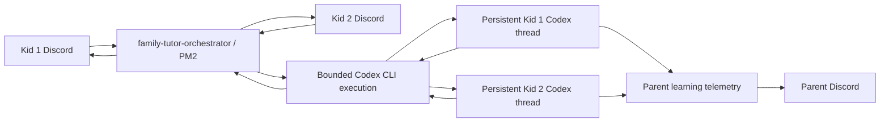

# Architecture

```mermaid
flowchart LR
  K1[Kid 1 Discord] --> B[family-tutor-orchestrator / PM2]
  K2[Kid 2 Discord] --> B
  B --> C[Bounded Codex CLI execution]
  C --> T1[Persistent Kid 1 Codex thread]
  C --> T2[Persistent Kid 2 Codex thread]
  T1 --> C
  T2 --> C
  C --> B
  B --> K1
  B --> K2
  T1 --> P[Parent learning telemetry]
  T2 --> P
  P --> PD[Parent Discord]
```

The reusable implementation lives in `skills/family-tutor`; this project contains only public architecture/docs; each real family instance lives under `runs/family/`.
