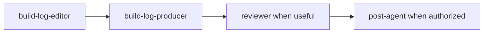

# Neo Build Log Project Rules

Neo Build Log is a thin content project. Root Neo instructions and `MISSION.md` apply first.

## Ownership

Do not add a project-local scheduler, workflow database, task engine, routing policy, worker launcher, retry system, publication browser adapter, or lifecycle state machine.

Agents Relay owns orchestration. Shared Neo skills own reusable execution capabilities. This project owns only Build-Log-specific content behavior and its ignored run artifacts.

## Planner contract

When a planner receives a Build Log objective:

- resolve this project and use its visible project agents;
- normally create one durable Task for one target day/episode;
- keep evidence reconstruction, story editing, visual planning, production, render, QA, and publication inside that Task's `agentGraph` unless a phase truly needs an independent durable lifecycle;
- never invent unavailable agents;
- do not hard-code worker/provider/model selection;
- do not split ordinary workflow mechanics into sibling Tasks.

The preferred internal graph is:



The exact graph may be smaller when publication or review is not required.

## Truth and evidence

For the target local date:

- use authoritative conversation, Agents Relay, GitHub, runtime, and artifact evidence;
- distinguish observed facts, interpretation, and unknowns;
- infer intent only when supported by real discussion/work evidence;
- never fabricate progress, success, failures, screenshots, footage, metrics, or motivations;
- remove credentials, private identifiers, internal-only URLs, sensitive personal material, and other unsuitable private context from public outputs;
- preserve useful authoritative references in private evidence/next-day artifacts.

## Required content outcome

Build Log is a content package, not a text-only report.

A normal successful run should produce:

- evidence/source notes;
- a public narrative story;
- concise social copy;
- a Markcut-compatible `video.md`;
- real captured/generated media when required and available;
- a rendered video when technically possible;
- observable QA notes;
- publication receipt/status when the Task authorizes publication;
- a private next-day work-start brief.

If real media is unavailable, do not substitute fake evidence. Preserve a truthful storyboard/capture plan and exact blocker so a retry can continue without repeating completed editorial work.

## Run contract

Use the root universal run layout:

```text
runs/<YYYY-MM-DD[-slug]>/
```

Do not add a redundant `runs/neo-build-log/` wrapper. Every per-run artifact belongs in the dated run: evidence, drafts, media, generated assets, Markcut state, logs, QA, next-day brief, and publication receipts.

## Publication

Publication target and authorization belong to the autonomous Job or specific Task, not this project. When authorized, use shared `post-agent`, perform duplicate-safe platform verification, and persist the exact receipt/state. Authentication or platform blockers must be reported truthfully.

## Project learnings

- 2026-09-12: A Build Log should expose a concrete gap/payoff immediately and derive its story from observable work, not a generic tutorial.
- 2026-09-26: Treat the Build Log as a content project. The tracked project defines editorial behavior and project agents; Agents Relay owns execution orchestration.
- 2026-09-26: A prose reference to a shared role is insufficient if that role is not discoverable in resolved planner context. Build-Log-specific editorial/production roles must be real project agents; reusable execution remains in shared skills.
