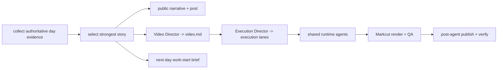

# Neo Build Log Project Rules

Neo Build Log is a thin Neo content project. Root `AGENTS.md` and `MISSION.md` apply first. Do not build a second workflow/runtime system inside this project.

## Ownership

Agents Relay owns durable Jobs, Tasks, scheduling, planner rounds, retries, leases, dependencies, worker/model routing, events, review, and reconciliation. Shared Neo agents/skills own reusable media understanding, Video Director, Execution Director, demo/capture/image/video execution, Markcut production, QA, publishing, and troubleshooting.

Neo Build Log owns only the Build Log-specific editorial contract and its ignored run artifacts.

## Execution model

The long-lived Agents Relay Job is `neo-build-log-daily` (PR #34). It remains ACTIVE across successful daily runs. Each requested or scheduled date creates one durable Build Log Task. Prefer one Task per day unless an intermediate result genuinely needs independent review/block/retry lifecycle.

A daily Task may use an `agentGraph` made only from agents visible in the resolved Agents Relay context. Internal graph nodes are reasoning/execution roles, not durable Tasks.

Typical flow:



Do not hard-code provider/model choices here; worker-router and model-router own routing.

## Editorial contract

Build Log is a story of real Neo work, not a changelog dump. For the target local date:

- reconstruct the user's underlying intent only when supported by actual conversation/work evidence;
- identify the problem/constraint, important attempts or failed directions, turning point, implemented result, remaining uncertainty, and useful takeaway;
- select the strongest coherent story or small set of connected stories instead of enumerating every PR/task;
- separate observed facts from interpretation;
- never invent success, motivation, metrics, or missing evidence;
- remove credentials, private identifiers, sensitive personal material, internal-only URLs, and unsuitable private context from public outputs;
- public copy should be understandable beyond the immediate engineering thread while remaining technically accurate.

A strong episode normally has: hook -> problem/constraint -> investigation/attempt -> build/change -> observable result -> payoff/next hook. This is an editorial shape, not a separate workflow engine.

## Daily outputs

Each daily Task should leave, when evidence supports them:

- the evidence/source manifest or notes used to reconstruct the day;
- the public narrative Build Log;
- a concise social/post version;
- canonical Markcut `video.md` from the shared Video Director;
- Execution Director lane files and produced media when unresolved assets require execution;
- rendered/verified video and QA notes;
- publication receipts/status when publication is authorized and succeeds;
- a private next-day work-start brief covering where work ended, what matters next, user-required actions, 李友/shared dependencies when applicable, autonomous follow-ups, risks, and authoritative references.

The next-day brief is operational/private input, not public copy.

## Shared production architecture

Use the current shared system instead of project-local duplicates:

- Video Director owns story/timeline decisions and canonical Markcut `video.md`.
- Execution Director compiles unresolved media requirements into typed execution lanes.
- Shared runtime agents/capabilities execute demo, capture, image, video, vision, audio/TTS, and other media needs.
- Markcut owns preview/render semantics.
- Shared QA/reviewer capabilities inspect observable artifacts.
- `post` / post-agent owns publication and platform-side verification.
- Agents Relay troubleshooter/recovery handles execution failures.

If a missing capability is reusable across projects, improve the owning shared skill/agent rather than re-implementing it here.

## Run contract

Follow the root universal run contract:

```text
runs/<YYYY-MM-DD[-slug]>/
```

Use a named series wrapper only when there is a real distinct series. Do not add the redundant `runs/neo-build-log/` wrapper for future daily runs.

All per-run evidence, generated content, media, Execution Director outputs, Markcut state, logs, QA, next-day brief, and publication receipts belong in the dated ignored run directory. Historical ignored runs may remain in their legacy locations; never delete the only copy merely to normalize paths.

## Publication

The standing `neo-build-log-daily` Job contains the scope of autonomous publication authorization. Publication must still use the shared post workflow, verify the platform-side result, and preserve receipts. If authentication/platform state blocks publication, preserve the completed artifact plus exact blocker and do not claim success.

## Project learnings

- 2026-09-12: Build Log stories must come from observable work rather than generic tutorials; the hook should expose the concrete gap/payoff immediately.
- 2026-09-26: Project-local Director/Capture/audio/schema machinery duplicated capabilities now owned by shared Neo agents/skills. Keep Build Log thin: Agents Relay owns orchestration, shared capabilities own execution, and this project owns only the editorial contract plus run artifacts.
