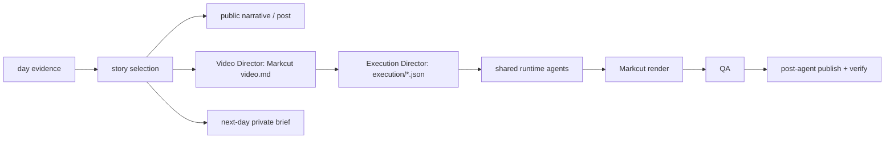

# Neo Build Log

Neo Build Log turns the real work of building Neo into evidence-backed public stories, short written posts, and videos, while also preserving a private next-day work-start brief.

It is intentionally a thin Neo content project. Agents Relay drives each daily production Task; shared Neo agents and skills perform research/evidence collection, video planning, execution, Markcut rendering, QA, and publishing. This directory keeps only the Build Log-specific editorial contract plus ignored run artifacts.

## Durable runtime

The recurring autonomous Job is `neo-build-log-daily` in PR #34. It is scheduled daily at 23:00 America/Toronto and remains ACTIVE across daily runs.

One date normally maps to one durable Task, for example:

> Reconstruct and produce the Neo Build Log for 2026-09-25.

Within that Task, an Agent Graph may compose visible shared roles/capabilities. Durable child Tasks are only needed for independently reviewable, blockable, retryable, or externally dependent outcomes.

## Production flow



The project does not own its own scheduler, workflow database, model routing, capture engine, audio engine, or publishing engine.

## Story contract

A Build Log should reconstruct the meaningful story behind the day's work rather than list PRs or tasks. The preferred shape is:

1. concrete hook;
2. problem or constraint;
3. investigation, rejected attempt, or surprise;
4. the actual build/change;
5. observable result or unresolved state;
6. useful payoff and natural next hook.

Claims must be grounded in authoritative evidence. Public output excludes private/sensitive data and does not fabricate motivations or results.

## Shared capabilities

Use current shared capabilities discovered at runtime:

- Agents Relay planner/lifecycle/scheduling/troubleshooter;
- shared evidence/vision agents where visual artifacts need interpretation;
- Video Director for canonical Markcut `video.md`;
- Execution Director for typed execution lanes;
- shared demo/capture/image/video/audio capabilities for asset production;
- Markcut for preview/render;
- shared reviewer/QA where useful;
- `post` / post-agent for authorized publication and platform verification.

## Artifacts

Future daily runs live at:

```text
runs/<YYYY-MM-DD[-slug]>/
```

A run may contain evidence manifests/notes, narrative drafts, social copy, `video.md`, `execution/`, generated/captured assets, Markcut state, output video, QA notes, next-day brief, logs, and publication receipts.

`runs/` is ignored by Git. Historical runs under the former `runs/neo-build-log/` wrapper are preserved as legacy run evidence and do not need destructive migration.

See `AGENTS.md` for the enforceable project contract.
