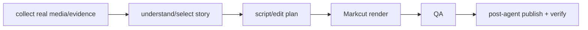

# Vlog Project Rules

Vlog is a thin Neo content project. Root `AGENTS.md` and `MISSION.md` apply first. Do not build a second workflow/runtime system inside this project.

## Ownership

Agents Relay owns durable Jobs, Tasks, scheduling, retries, leases, dependencies, planner rounds, worker/model routing, events, and reconciliation. Neo shared skills/agents provide phone media access, vision, audio/TTS, Markcut production, publishing, and troubleshooting. Vlog owns only Vlog-specific production rules and ignored run artifacts.

## Execution model

The long-lived `vlog-autonomous` Agents Relay Job remains ACTIVE. A manual or scheduled Vlog cycle creates one durable Vlog Task. Prefer one Task for one episode/day unless an intermediate result genuinely needs its own durable lifecycle.

Within a Vlog Task, use an `agentGraph` when multiple reasoning roles materially improve the result. Agent Graph nodes are internal roles, not durable child Tasks. Use only agents visible in the resolved Agents Relay execution context; do not create Vlog-local copies of shared agents.



The exact graph may vary by episode. Do not hard-code worker/provider/model choices here; worker-router and model-router own those decisions.

## Production contract

- Use only real source evidence from the requested local-date window. Do not widen the window or fabricate events just to produce an episode.
- Phone media comes from NeoX through the installed phone-media capability. Clear staged phone exports after verified local download.
- Use shared visual-understanding/Markcut capabilities for media understanding and editing. Do not create a Vlog-local vision engine.
- Prefer original footage and useful original sound. Use shared audio/TTS skills when narration or BGM is needed.
- Render vertical short-form video unless the Task explicitly asks for another format.
- Verify the observable final video, not only a command exit code.
- Publishing is performed through the shared `post` skill / `post-agent`. The Autonomous Vlog Job is authorized to publish its truthful episode to WeChat Channels; verify platform-side state and save receipts/status in the run.

## Run contract

Follow the root universal run contract exactly:

```text
runs/<YYYY-MM-DD[-slug]>/                 # standalone / daily
runs/<series-name>/<YYYY-MM-DD[-slug]>/   # real named series only
```

A run may contain source manifests, selected assets, Markcut source, generated audio/video, QA notes, logs, and publish receipts. `runs/` is ignored by Git. Do not add generic wrapper directories such as `neo-vlog` or `daily-vlog`.

## Boundaries

- Neo identity comes from root `MISSION.md`; do not duplicate a Neo persona in Vlog.
- Human voice/profile data is not a Vlog-owned identity model. Use shared/private profile or TTS inputs when needed.
- Neo Build Log is owned by the separate `neo-build-log/` project; do not mirror its series definition here.
- Do not add Vlog-local SQLite job tables, schedulers, worker launchers, route/profile configs, lifecycle state machines, or persistent daemons. If orchestration capability is missing, improve Agents Relay or a shared Neo skill instead.
- Do not create template/style/persona folders for a single default. Add reusable Vlog-only source only when multiple real uses justify it.

## Project learnings

- 2026-09-26: Vlog previously duplicated Agents Relay with its own SQLite jobs, routing config, autopilot worker, personas, style, and series/template abstractions. Keep Vlog thin: Agents Relay owns orchestration; shared Neo skills own reusable capabilities; this project owns only Vlog-specific production rules and run artifacts.
