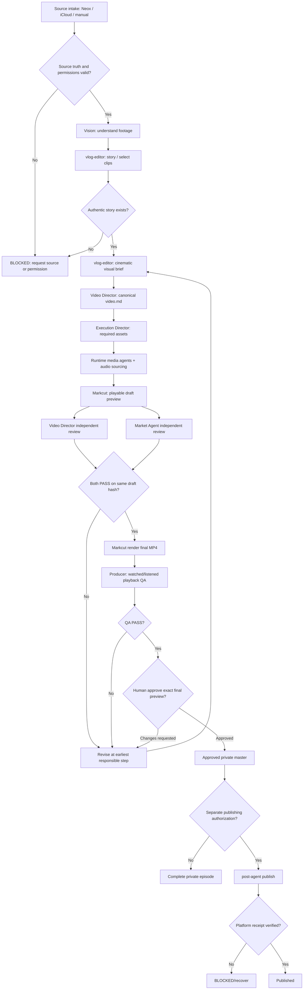

# Cinematic Vlog production template

This is a reusable, tracked **template**, not a run. All actual episode material and evidence stays in ignored `vlog/runs/YYYY-MM-DD[-slug]/`. Keep **one top-level durable episode Task**; stages are steps in its agentGraph and do not automatically require separate Tasks. Existing `../cinematic-episode.md` defines source schemas and quantitative QA.

## Executable design graph

## Agent, input, output and gate contracts

All paths below are relative to each episode run folder.

| Step | Owner / agent | Input | Output | Review / rejection |
|---|---|---|---|---|
| Intake | Neox phone media / iCloud watcher / manual | authorized originals, requested date window | `source-manifest.json`, `input/` | Reject missing hash, permission, source, or invalid time window |
| Understanding | shared vision | original media + manifest | `analysis/observations.md` with clip IDs and timecodes | Distinguish observation from assumptions |
| Story | `vlog-editor` | source + observations + intent | `story.md` | Real hook, conflict/discovery and payoff or INSUFFICIENT_SOURCE |
| Direction | `vlog-editor` | story and selected clips | `visual-brief.md` | Shot scale, composition, motion, continuity, color, pacing, real audio and BGM per beat |
| Shot authoring | shared Video Director | story + visual brief | `video.md` | Canonical Markcut source; explicit placeholders for missing assets |
| Asset compilation | shared Execution Director | `video.md` markers | `execution/` typed requests | No invented footage or unsupported tool assumption |
| Asset sourcing | reusable media runtime, audio-sourcing | source + requests + license rules | `assets/` and provenance/license records | Reject unauthorized media/music; original footage has priority |
| Draft | Markcut player | `video.md` + resolved assets | preview + `reviews/draft.json` hash | Must be visibly playable before reviews |
| Film review | Video Director review | preview + draft hash + creative brief | `reviews/video-director.md` | PASS / CHANGE_REQUIRED, timecoded changes |
| Audience review | Market Agent review | same preview + hash | `reviews/market.md` | Independent PASS / CHANGE_REQUIRED |
| Final render | Markcut | both PASS reports on identical draft | `output/final.mp4` | Never render final on divergent reviews |
| Playback QA | producer/media QA | actual MP4, provenance, score rubric | `qa.md`, final hash, video/audio measures, observed playback notes | >=85/100, each category >=70%, no critical issue; otherwise revise |
| Human approval | user via preview UI | playable final video, QA, review outcomes | `reviews/human-approval.json` | Explicit approved / changes_requested, actor, timestamp, exact file hash |
| Publication (optional) | shared post-agent | approved master + **separate** platform-specific publishing authorization | `publish/receipt.json` | Verify platform-side receipt; otherwise blocked |

## Required review and approval rules

- A changed `video.md` or draft hash invalidates both automated review PASS decisions. Revisions rerun both reviews and actual playback QA.
- AI reviewers cannot grant human approval. Human approval covers one immutable final MP4 hash; changed output requires renewed QA and approval.
- Show the actual playable video (fullscreen if supported), `visual-brief.md`, director and Market review findings, and QA evidence before requesting approval.
- Approval is **not authorization to publish**. Post-agent may run only with an explicit separate publication decision; a missing response is neither approval nor publishing authorization.
- Keep Graph/task lifecycle with Agents Relay, and rendering with Markcut. Do not introduce a local orchestration engine or duplicate renderer.

## Reusable external inspiration

- [Lemo-Opuscar](https://github.com/lemomo-ai/lemo-opuscar): separate director/style/technique, timelines and audiovisual quality checks.
- [video-shotcraft](https://github.com/Ding200602/video-shotcraft): cinematic shot and motion-design patterns.

These are **reference ideas**, not imported implementation; inspect their licenses before copying code, descriptions or media.
